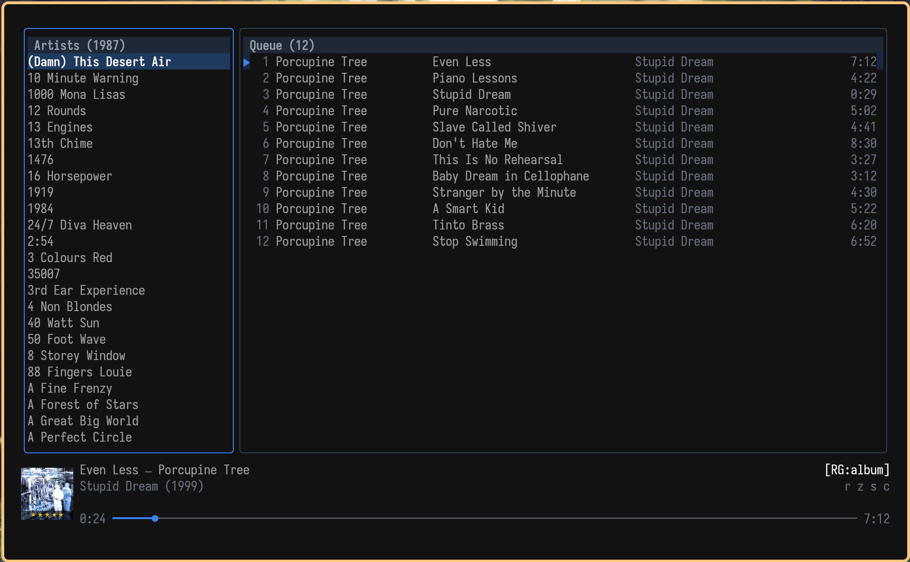
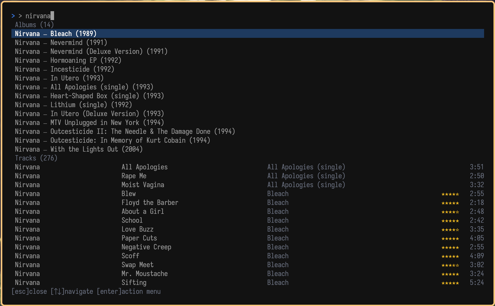
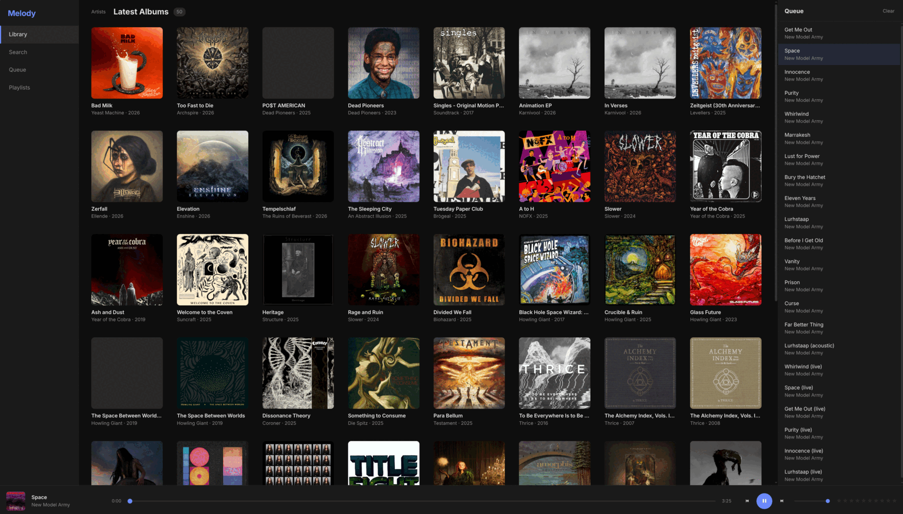
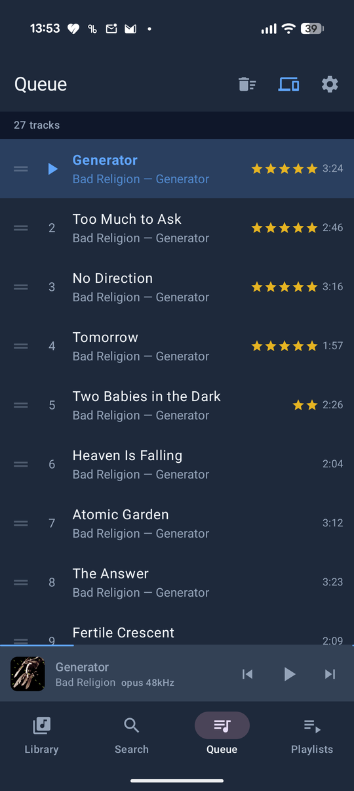
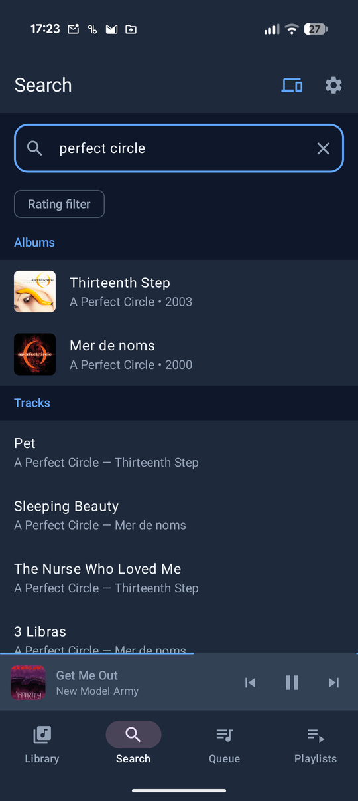
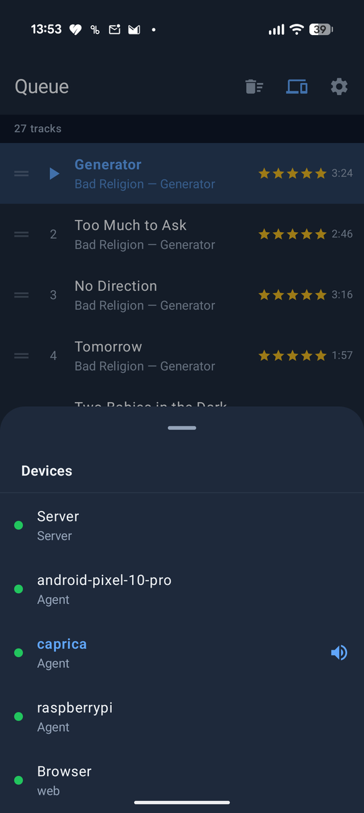

# Melody

> **This software was almost entirely written by an LLM (Claude by Anthropic).**
> A human provided direction, design decisions, and testing — but the code itself is LLM-generated.
> If that's a dealbreaker for you, now you know.

A personal music server that plays your local music library across all your devices.

## Screenshots

### Terminal UI




### Web UI



### Android

<p float="left">
  
  
  
</p>

## What it does

Melody scans your music folder and lets you browse, search, queue, and play your music from anywhere — your terminal, your phone, or any other machine on your network.

Pick a song on your phone, switch playback to your desktop speakers without missing a beat, then control everything from the couch using the terminal UI. All your devices see the same queue and stay in sync.

## How it works

**melodyd** is the server. Point it at your music folder and it takes care of the rest — scanning, indexing with FTS5 full-text search, and playing through mpv. It speaks the MPD protocol, so standard MPD tools (like scrobblers) work out of the box. Supports track and album ratings, replay gain, and instant UI updates via MPD idle.

**melody-agent** turns any machine into a playback target. Install it on your living room PC, your laptop, wherever — each one shows up as an output device you can switch to. Supports optional resume-on-connect to automatically resume playback when the agent reconnects.

**melody-tui** is a terminal interface for browsing your library, managing the queue, rating tracks and albums, and controlling playback.

**melody-cli** is a command-line client for scripting — search, queue, rate, view lyrics, and control playback from shell scripts or the command line.

**The Android app** does everything the TUI does, plus streaming playback directly on your phone. Features multi-select search results with batch queue operations, structured rating filters, offline album downloads with library filtering, and automatic server selection based on network.

**melody-rofi** gives you quick album and track selection from a rofi/dmenu launcher.

**melody-musiclist** exports your library as a static HTML page.

**melody-lrcmatch** bulk-matches your library against a local [lrclib](https://lrclib.net) database dump to generate .lrc sidecar files for synced lyrics display.

## Getting started

### Build

```sh
./build
```

Binaries go into `bin/`. Needs Go 1.24+.

### Configure the server

Config lives at `~/.config/melody/melodyd.toml`. Set your music directory:

```toml
[library]
music_dir = "/path/to/your/music"
```

Start it:

```sh
./bin/melodyd
```

Or install the systemd service for auto-start:

```sh
cp melodyd/melodyd.service ~/.config/systemd/user/
systemctl --user enable --now melodyd
```

### Connect a client

The TUI connects to localhost by default. For a remote server, edit `~/.config/melody/melody-tui.toml`:

```toml
mpd_host = "192.168.1.10"
mpd_port = 6600
```

### Add a remote speaker

Install melody-agent on another machine and edit `~/.config/melody/melody-agent.toml`:

```toml
[agent]
name = "living-room"
master = "192.168.1.10:6600"
```

It shows up as an output device in the TUI (press `D`) and the Android app.

### Android

```sh
cd android
./gradlew installDebug
```

Enter your server address in the app settings.

### Arch Linux

```sh
makepkg -si
```

## Lyrics

Melody supports synced and plain lyrics. When you view lyrics, the server checks for a `.lrc` file next to the audio file first, then falls back to fetching from [lrclib.net](https://lrclib.net) (and saves the result as a `.lrc` sidecar for next time).

For bulk-matching your entire library offline, use `melody-lrcmatch` with a local lrclib SQLite dump:

```sh
melody-lrcmatch -db ~/.local/share/melody/melody.db -lrclib ~/lrclib.sqlite3
```

The TUI shows synced lyrics in a sidebar that auto-scrolls with playback. The CLI supports `melody-cli lyrics` to print lyrics for the current track.

## Scrobbling

Melody speaks MPD, so any MPD scrobbler works. [mpdscribble](https://github.com/MusicPlayerDaemon/mpdscribble) is a good choice — just point it at melodyd's port.

## License

MIT
