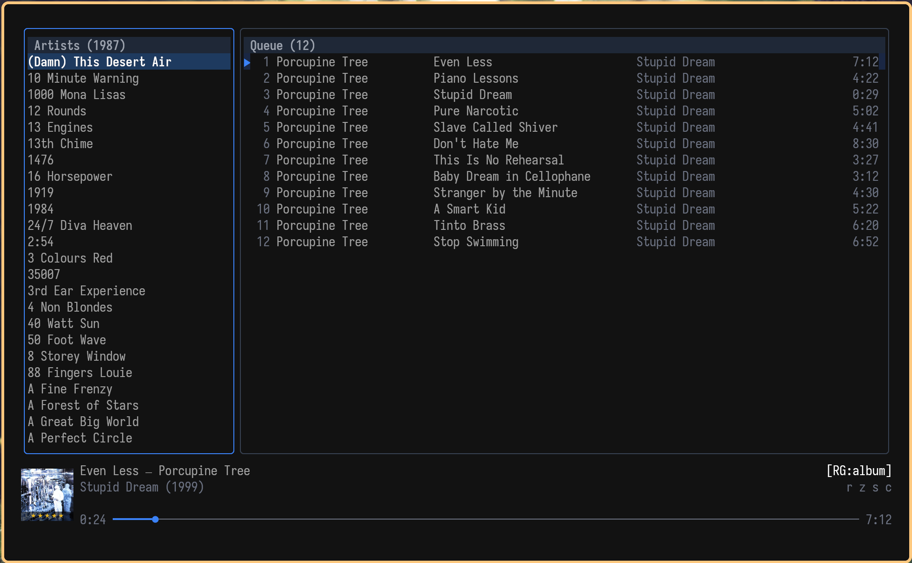
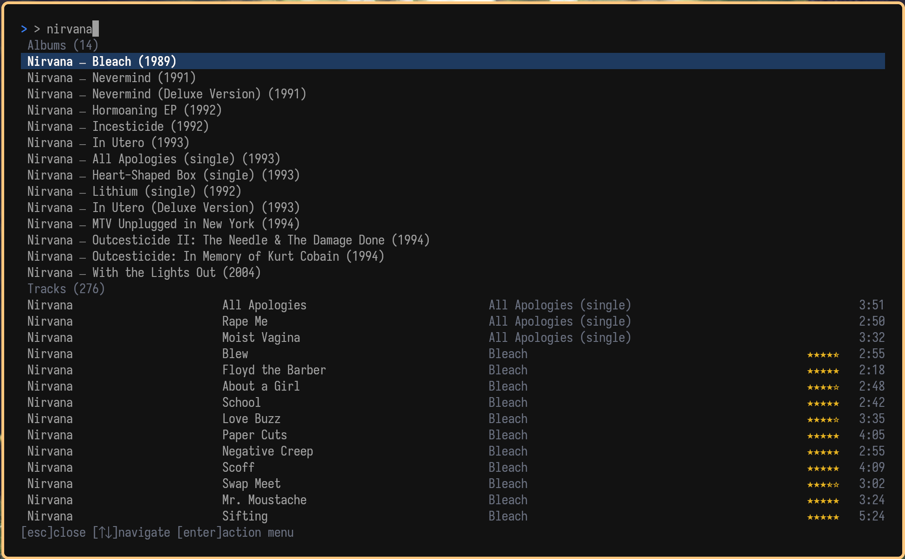
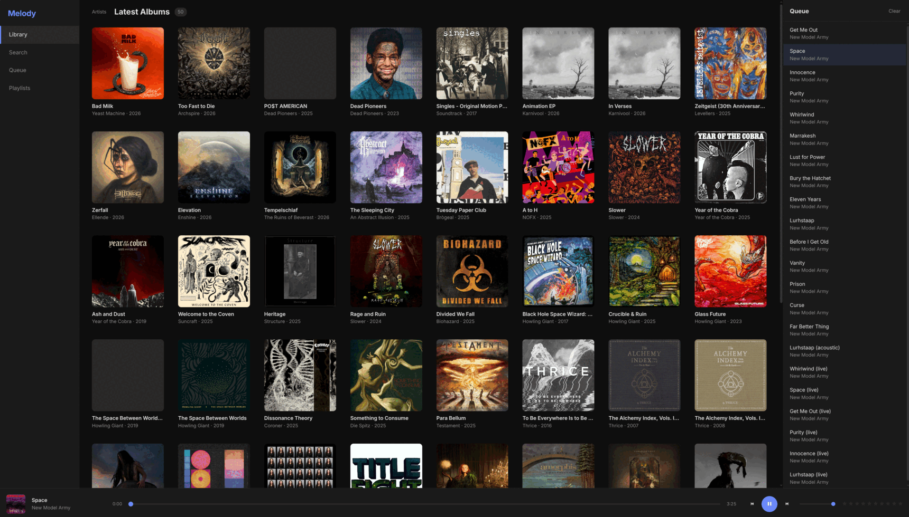
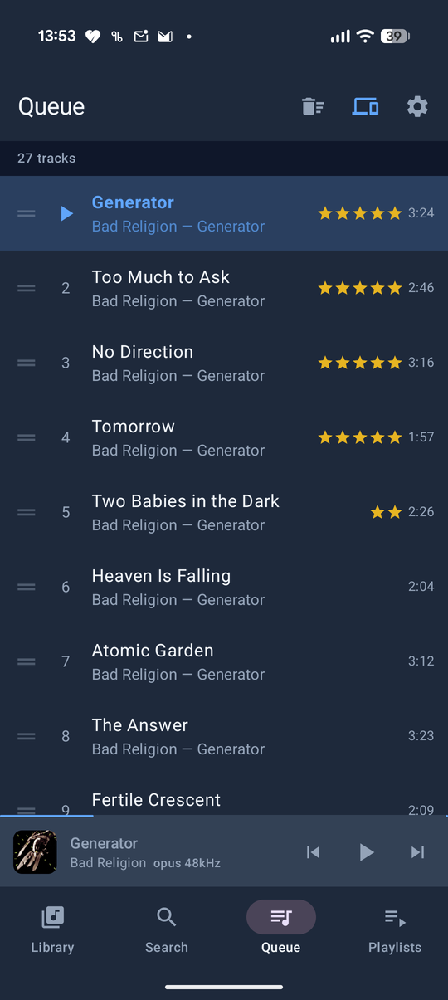
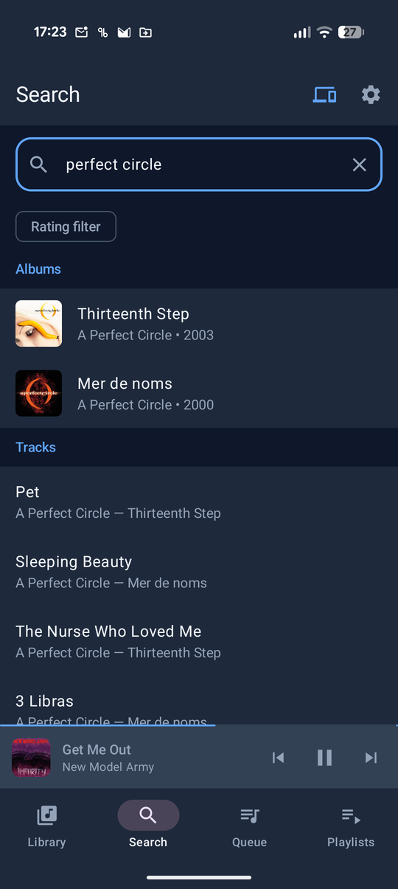
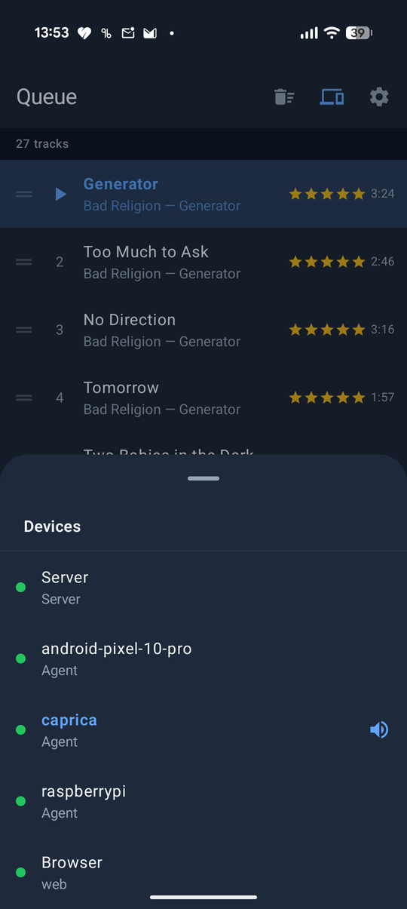

# Melody

> **This software was almost entirely written by an LLM (Claude by Anthropic).**
> A human provided direction, design decisions, and testing — but the code itself is LLM-generated.
> If that's a dealbreaker for you, now you know.

A personal music server that plays your local music library across all your devices.

## Screenshots

### Terminal UI




### Web UI



### Android

<p float="left">
  
  
  
</p>

## What it does

Melody scans your music folder and lets you browse, search, queue, and play your music from anywhere — your terminal, your phone, or any other machine on your network.

Pick a song on your phone, switch playback to your desktop speakers without missing a beat, then control everything from the couch using the terminal UI. All your devices see the same queue and stay in sync.

## How it works

**melodyd** is the server. Point it at your music folder and it takes care of the rest — scanning, indexing with FTS5 full-text search, and playing through mpv. It speaks the MPD protocol, so standard MPD tools (like scrobblers) work out of the box. Supports track and album ratings, replay gain, and instant UI updates via MPD idle.

**melody-agent** turns any machine into a playback target. Install it on your living room PC, your laptop, wherever — each one shows up as an output device you can switch to. Supports optional resume-on-connect to automatically resume playback when the agent reconnects.

**melody-tui** is a terminal interface for browsing your library, managing the queue, rating tracks and albums, and controlling playback.

**melody-cli** is a command-line client for scripting — search, queue, rate, view lyrics, and control playback from shell scripts or the command line.

**The Android app** does everything the TUI does, plus streaming playback directly on your phone. Features multi-select search results with batch queue operations, structured rating filters, offline album downloads with library filtering, and automatic server selection based on network.

**melody-rofi** gives you quick album and track selection from a rofi/dmenu launcher.

**melody-musiclist** exports your library as a static HTML page.

**melody-lrcmatch** bulk-matches your library against a local [lrclib](https://lrclib.net) database dump to write .lrc sidecar files, so lyrics are available instantly without network requests.

## Getting started

### Build

```sh
./build
```

Binaries go into `bin/`. Needs Go 1.24+.

### Configure the server

Config lives at `~/.config/melody/melodyd.toml`. Set your music directory:

```toml
[library]
music_dir = "/path/to/your/music"
```

Start it:

```sh
./bin/melodyd
```

Or install the systemd service for auto-start:

```sh
cp melodyd/melodyd.service ~/.config/systemd/user/
systemctl --user enable --now melodyd
```

### Connect a client

The TUI connects to localhost by default. For a remote server, edit `~/.config/melody/melody-tui.toml`:

```toml
mpd_host = "192.168.1.10"
mpd_port = 6600
```

### Add a remote speaker

Install melody-agent on another machine and edit `~/.config/melody/melody-agent.toml`:

```toml
[agent]
name = "living-room"
master = "192.168.1.10:6600"
```

It shows up as an output device in the TUI (press `D`) and the Android app.

### Android

```sh
cd android
./gradlew installDebug
```

Enter your server address in the app settings.

### Arch Linux

```sh
makepkg -si
```

## Configuration Reference

Melody follows XDG paths. Config files live under
`$XDG_CONFIG_HOME/melody` or `~/.config/melody`; daemon state lives under
`$XDG_DATA_HOME/melody` or `~/.local/share/melody`.

### melodyd

`melodyd` reads `~/.config/melody/melodyd.toml` and creates it on first
start.

```toml
[server]
name = ""
bind_to_address = ["0.0.0.0:6701", "/run/user/1000/melody/melodyd.sock"]
api_secret = ""
base_url = ""
web_secret = ""

[library]
music_dir = ""
embed_lyrics = false
save_lrc = false

[player]
replaygain = "" # "off", "track", "album", or empty
volume = 100
mpv_path = "mpv"
mpv_socket = ""

[random]
tracks = 20

[mpd]
port = 6600
```

Notes:

- `server.name` is the display name for the local server output. Empty uses the hostname.
- `server.bind_to_address` accepts TCP addresses and Unix socket paths.
- `MELODYD_BIND_TO_ADDRESS` overrides `server.bind_to_address` with a comma-separated list.
- `server.base_url` should be set when clients need externally reachable stream URLs.
- `player.mpv_socket = ""` lets Melody create a runtime socket automatically.
- Go playback targets require `mpv` on the experimental mpv agent branch.

Daemon state files:

- `~/.local/share/melody/melody.db`
- `~/.local/share/melody/playqueue.json`
- `~/.local/share/melody/playstate.json`
- `~/.local/share/melody/active_device`
- `~/.local/share/melody/transcode_cache/`

### melody-agent

`melody-agent` reads `~/.config/melody/melody-agent.toml` and creates it on
first start.

```toml
[agent]
name = "living-room"
master = "192.168.1.10:6600"
music_dir = ""
format = ""
max_bitrate = 0

[player]
replaygain = "track"
volume = 100
mpv_path = "mpv"
mpv_socket = ""
```

Notes:

- `music_dir` enables direct file access when the agent can see the same library path.
- Empty `music_dir` streams audio from the daemon.
- `format` and `max_bitrate` advertise the agent's preferred stream/transcode format; empty/zero means original or unrestricted.
- Go agents require `mpv` on the experimental mpv agent branch.

### melody-tui

`melody-tui` reads `~/.config/melody/melody-tui.toml` and creates it on first
start.

```toml
mpd_host = "localhost"
mpd_port = 6600
```

`MPD_HOST` and `MPD_PORT` override the config. `MPD_HOST` may include a port,
for example `MPD_HOST=192.168.1.10:6600`.

### melody-cli

`melody-cli` reads `~/.config/melody/melody-cli.toml` and creates it on first
start.

```toml
mpd_host = "localhost"
mpd_port = 6600
```

`MPD_HOST` and `MPD_PORT` override the config. `melody-cli raw <command>`
sends an arbitrary MPD command.

Useful commands:

```sh
melody-cli current
melody-cli lyrics
melody-cli rate <songid> <rating>
melody-cli albumrate <artist> <album> <date> <rating>
melody-cli raw status
```

### melody-musiclist

`melody-musiclist` reads `~/.config/melody/melody-musiclist.toml` and creates
it on first start.

```toml
[mpd]
host = "localhost"
port = 6600

[upload]
host = "proteus"
path = "/srv/http/list"

[output]
temp_file = "/tmp/musiclist.html"
```

### melody-lrcmatch

`melody-lrcmatch` reads `~/.config/melody/melody-lrcmatch.toml` and creates
it on first start. Command-line flags override the config.

```toml
melody_db = ""
lrclib_db = ""
netease = false
dry_run = false
verbose = false
```

The same options are available as flags:

```sh
melody-lrcmatch -db ~/.local/share/melody/melody.db \
  -lrclib ~/lrclib.sqlite3 \
  -netease \
  -dry-run \
  -verbose
```

- `-db`: path to Melody's SQLite database.
- `-lrclib`: path to an lrclib SQLite dump.
- `-netease`: fetch missing lyrics from NetEase Cloud Music.
- `-dry-run`: print matches without writing files.
- `-verbose`: show detailed match/mismatch information for NetEase queries.

### Android App

The Android app stores settings in app preferences:

- Local server address, e.g. `192.168.1.10:6701`.
- External server address, e.g. `https://music.example.com`.
- Home WiFi SSID for automatic local/external server switching.
- Device name.
- Device secret.
- Audio format: original, Opus, MP3, AAC, or FLAC.
- Audio bitrate: max, 64k, 128k, 192k, 256k, or 320k.
- ReplayGain mode: off, track, or album.
- Resume on connect.

Release signing reads properties from
`$MELODY_ANDROID_SIGNING_PROPERTIES` or
`~/.local/android/release-keys/melody.properties`:

```properties
MELODY_ANDROID_STORE_FILE=/path/to/keystore
MELODY_ANDROID_STORE_PASSWORD=...
MELODY_ANDROID_KEY_ALIAS=...
MELODY_ANDROID_KEY_PASSWORD=...
```

## Lyrics

Melody supports synced and plain lyrics. When you view lyrics, the server checks for a `.lrc` sidecar file next to the audio file first, then embedded tags, and falls back to fetching from [lrclib.net](https://lrclib.net) (saving the result as a `.lrc` sidecar for next time).

For bulk-matching your entire library offline, use `melody-lrcmatch` with a local lrclib SQLite dump:

```sh
melody-lrcmatch -db ~/.local/share/melody/melody.db -lrclib ~/lrclib.sqlite3
```

The TUI shows synced lyrics in a sidebar that auto-scrolls with playback. The CLI supports `melody-cli lyrics` to print lyrics for the current track.

## Scrobbling

Melody speaks MPD, so any MPD scrobbler works. [mpdscribble](https://github.com/MusicPlayerDaemon/mpdscribble) is a good choice — just point it at melodyd's port.

## License

MIT
